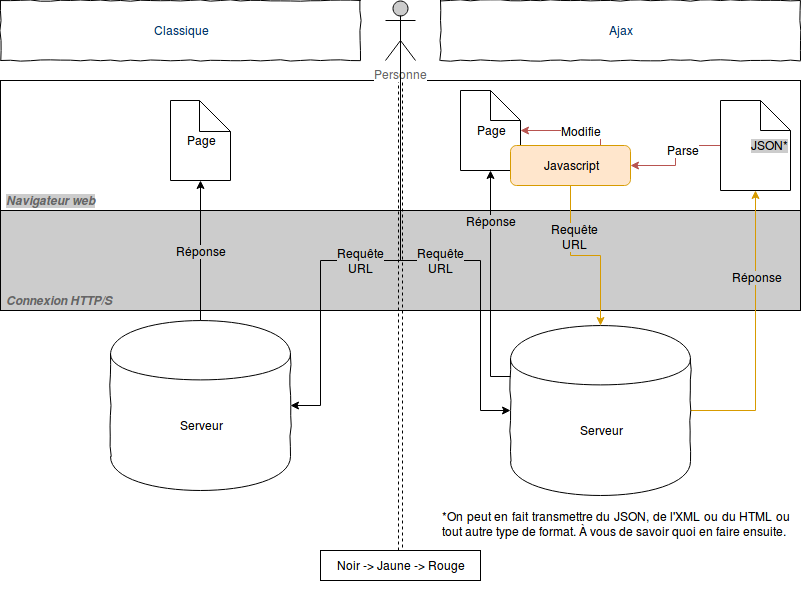
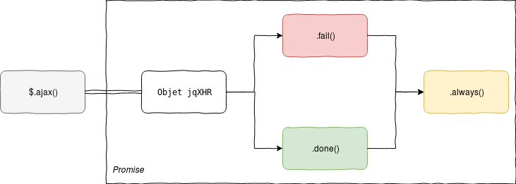

<link rel="stylesheet" href="../styles.css" data-marp-path-resolver="href" />

# Introduction au javascript

## Les données après le chargement : AJAX et son utilisation

Thibault Clérice,
École Nationale des Chartes
https://github.com/ponteineptique/cours-javascript

---

# Ajax

- *Asynchronous Javascript And Xml*
- Requête / Code asynchrone : code dont l'exécution n'est pas bloquante pour le reste de la page.

```Javascript
// Pseudocode bien sûr
var x = 1;
asynchrone("20 secondes puis afficher 2");
console.log(x);
```
> Console.log affichera `1` d'abord, puis affichera `2` 20 secondes environ plus tard.

- Permet de récupérer des données une fois la page affichée
- Contrairement à ce que son nom indique, permet de récupérer tout type de contenu.
- Peut aussi être utiliser pour envoyer des données sans en récupérer en retour.

---

# Ajax (2)



---

# Ajax : les promesses

http://api.jquery.com/jQuery.ajax/

```javascript
var jqxhr = $.ajax("http://google.fr")
  .done(function() {
    alert( "success" );
  })
  .fail(function() {
    alert( "error" );
  })
  .always(function() {
    alert( "complete" );
  });
```



---

# Ajax (4) : exercice en groupe

## Mise en place
- - Aller dans le dossier `cours-javascript/cours-3/serveur`
- Exécutez `python -m SimpleHTTPServer` qui ouvrira un serveur simple sur http://localhost:8000
	- Un fichier HTML = Une page
	- Cela permet de travailler dans des conditions proches du web sans forcément avoir la lourdeur de création de vrai serveur
	- **Important** : Nous utilisons cet outil afin de pouvoir faire des requêtes AJAX depuis de simples fichiers HTML. En effet, le mode ouverture classique (avec des adresses en `file:// `) ne permet pas l'exécution de requêtes AJAX pour des raisons de sécurité.

## Objectif

- On surveillera les changements de `select`
	- Le `select` nous pointe vers des URLS de fichiers JSON tous construits sur le même principe
- On affichera le texte et les métadonnées affiliées dans la `div#contenu`

---

# Exercice à la maison

- Utilisez le même serveur dans le dossier `./cours-3/serveur`
```sh
python -m SimpleHTTPServer
```
- Éditez exercice.html afin qu'il soit possible de requêter /api/latinLit.json et de trier les textes en fonction des objets json
- Testez sur http://localhost:8000/
